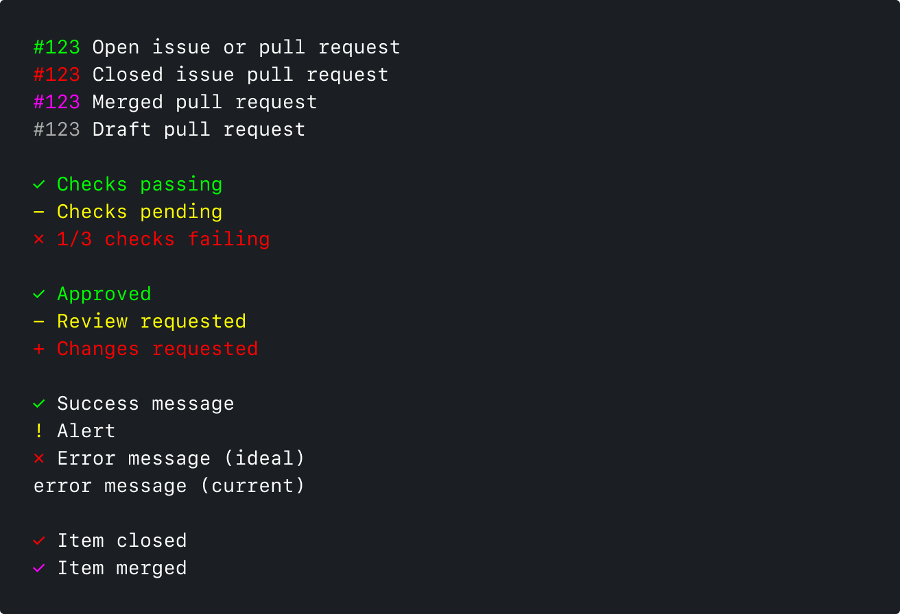
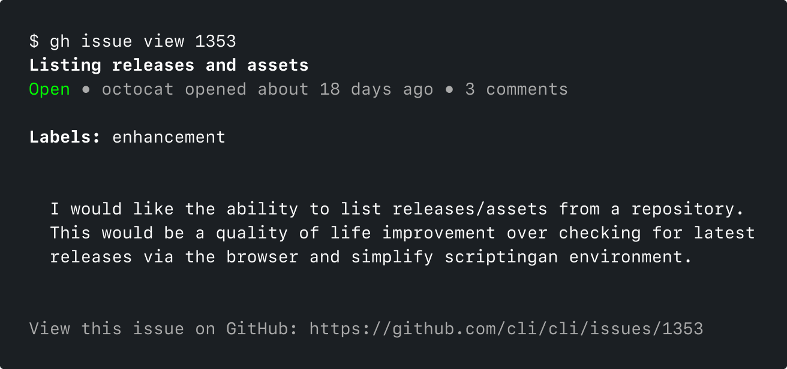
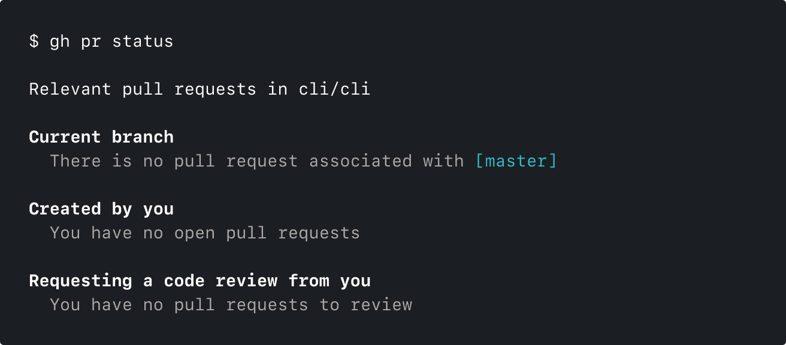
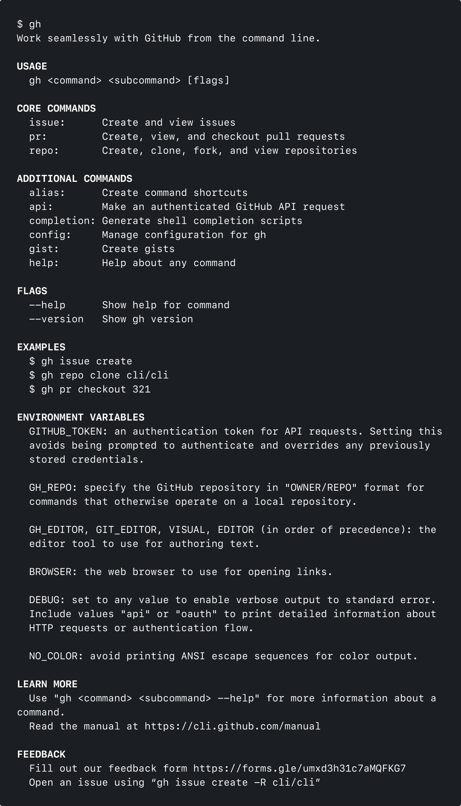

# Components

Components are consistent, reusable patterns that we use throughout the command line tool.

## Syntax

We show meaning or objects through syntax such as angled brackets, square brackets, curly brackets, parenthesis, and color.

### Branches

Display branch names in brackets and/or cyan


### Labels

Display labels in parenthesis and/or gray


### Repository

Display repository names in bold where appropriate


### Help

Use consistent syntax in [help pages](/docs/command-line-syntax.md) to explain command usage.

#### Literal text

Use plain text for parts of the command that cannot be changed

```shell
gh help
```

The argument help is required in this command.

#### Placeholder values

Use angled brackets to represent a value the user must replace. No other expressions can be contained within the angled brackets.

```shell
gh pr view <issue-number>
```

Replace "issue-number" with an issue number.

#### Optional arguments

Place optional arguments in square brackets. Mutually exclusive arguments can be included inside square brackets if they are separated with vertical bars.


```shell
gh pr checkout [--web]
```

The argument `--web` is optional.

```shell
gh pr view [<number> | <url>]
```

The "number" and "url" arguments are optional.

#### Required mutually exclusive arguments

Place required mutually exclusive arguments inside braces, separate arguments with vertical bars.

```shell
gh pr {view | create}
```

#### Repeatable arguments

Ellipsis represent arguments that can appear multiple times

```shell
gh pr close <pr-number>...
```

#### Variable naming

For multi-word variables use dash-case (all lower case with words separated by dashes)


```shell
gh pr checkout <issue-number>
```

#### Additional examples

Optional argument with placeholder:

```shell
<command> <subcommand> [<arg>]
```

Required argument with mutually exclusive options:

```shell
<command> <subcommand> {<path> | <string> | literal}
```

Optional argument with mutually exclusive options:

```shell
<command> <subcommand> [<path> | <string>]
```

## Prompts

Generally speaking, prompts are the CLI’s version of forms.

- Use prompts for entering information
- Use a prompt when user intent is unclear
- Make sure to provide flags for all prompts

### Yes/No

Use for yes/no questions, usually a confirmation. The default (what will happen if you enter nothing and hit enter) is in caps.


### Short text

Use to enter short strings of text. Enter will accept the auto fill if available


### Long text

Use to enter large bodies of text. E key will open the user’s preferred editor, and Enter will skip.


### Radio select

Use to select one option


### Multi select

Use to select multiple options


## State

The CLI reflects how GitHub.com displays state through [color](/docs/primer/foundations#color) and [iconography](/docs/primer/foundations#iconography).



## Progress indicators

For processes that might take a while, include a progress indicator with context on what’s happening.


## Headers

When viewing output that could be unclear, headers can quickly set context for what the user is seeing and where they are.

### Examples


The header of the `gh pr create` command reassures the user that they're creating the correct pull request.


The header of the `gh pr list` command sets context for what list the user is seeing.

## Lists

Lists use tables to show information.

- State is shown in color.
- A header is used for context.
- Information shown may be branch names, dates, or what is most relevant in context.


## Detail views

Single item views show more detail than list views. The body of the item is rendered indented. The item’s URL is shown at the bottom.



## Empty states

Make sure to include empty messages in command outputs when appropriate.



The empty state of `gh pr status`


The empty state of `gh issue list`

## Help pages

Help commands can exist at any level:

- Top level (`gh`)
- Second level (`gh [command]`)
- Third level (`gh [command] [subcommand]`)

Each can be accessed using the `--help` flag, or using `gh help [command]`.

Each help page includes a combination of different sections.

### Required sections

- Usage
- Core commands
- Flags
- Learn more
- Inherited flags

### Other available sections

- Additional commands
- Examples
- Arguments
- Feedback

### Example


